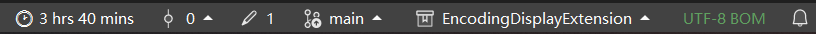

# Encoding Display Extension

一个用于 Visual Studio 2022 的扩展插件，可以在编辑器底部的状态栏实时显示当前文件的编码格式。



## ✨ 功能特性

- 📄 在状态栏实时显示当前编辑文件的编码格式
- 🔄 自动切换：当切换文件或窗口时自动更新编码显示
- 🚀 后台加载：采用异步加载方式，不影响 IDE 启动速度
- 💡 轻量级：代码简洁，对 IDE 性能几乎无影响

## 📋 系统要求

- **Visual Studio 2022** (17.0 或更高版本)
- **.NET Framework 4.7.2** 或更高版本
- **Windows 10/11**

## 📦 安装方法

### 方式一：从 VSIX 文件安装

1. 下载最新的 `.vsix` 文件（从 [Releases](../../releases) 页面）
2. 双击 `.vsix` 文件
3. 按照安装向导完成安装
4. 重启 Visual Studio

### 方式二：从源码构建安装

1. 克隆本仓库
2. 使用 Visual Studio 2022 打开 `EncodingDisplayExtension.sln`
3. 选择 `Release` 配置，构建解决方案
4. 在 `bin\Release\` 目录下找到生成的 `.vsix` 文件
5. 双击安装

## 🎯 使用方法

安装完成后，插件会自动生效：

1. 打开任意文本文件
2. 在 Visual Studio 底部状态栏查看编码信息
3. 切换不同文件时，编码显示会自动更新

### 支持的编码格式显示示例

| 编码 | 状态栏显示 |
|------|-----------|
| UTF-8 | `UTF-8` |
| UTF-8 with BOM | `UTF-8` |
| GB2312/GBK | `GB2312` |
| UTF-16 LE | `UTF-16` |
| ASCII | `US-ASCII` |

## 🔧 构建说明

### 前置条件

1. 安装 Visual Studio 2022
2. 安装 **Visual Studio extension development** 工作负载：
   - 打开 Visual Studio Installer
   - 选择"修改"
   - 勾选 "Visual Studio extension development"

### 构建步骤

```bash
# 克隆仓库
git clone https://github.com/your-username/EncodingDisplayExtension.git

# 打开解决方案
cd EncodingDisplayExtension
start EncodingDisplayExtension.sln
```

在 Visual Studio 中：
1. 右键点击解决方案 → 还原 NuGet 包
2. 选择 `Debug` 或 `Release` 配置
3. 按 `F5` 调试（会启动实验性 VS 实例）或 `Ctrl+Shift+B` 构建

## 📁 项目结构

```
EncodingDisplayExtension/
├── EncodingDisplayExtension.sln      # 解决方案文件
├── EncodingDisplayExtension.csproj   # 项目文件
├── EncodingDisplayExtensionPackage.cs # 主要代码文件
├── source.extension.vsixmanifest     # VSIX 清单文件
├── Properties/
│   └── AssemblyInfo.cs               # 程序集信息
└── README.md                         # 说明文档
```

## 🛠️ 技术实现

- 使用 `IVsTextManager` 获取当前活动的文本视图
- 使用 `IVsEditorAdaptersFactoryService` 将 COM 接口转换为 WPF 编辑器接口
- 通过 `ITextDocument.Encoding` 获取文件编码信息
- 监听 `WindowEvents.WindowActivated` 事件实现自动更新
- 采用 `AsyncPackage` 实现后台异步加载

## 📄 许可证

本项目采用 [MIT License](LICENSE) 开源许可证。

## 🤝 贡献

欢迎提交 Issue 和 Pull Request！

1. Fork 本仓库
2. 创建特性分支 (`git checkout -b feature/AmazingFeature`)
3. 提交更改 (`git commit -m 'Add some AmazingFeature'`)
4. 推送到分支 (`git push origin feature/AmazingFeature`)
5. 打开 Pull Request

## 📮 联系方式

如有问题或建议，请通过 [Issues](../../issues) 页面反馈。

