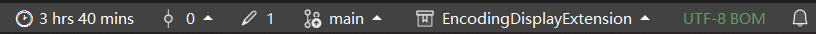

# Encoding Display Extension

一个用于 Visual Studio 2022 的扩展插件，可以在编辑器底部的状态栏实时显示当前文件的编码格式。



## ✨ 功能特性

- 📄 在状态栏实时显示当前编辑文件的编码格式
- ✏️ 点击状态栏的编码，可在 `UTF-8`、`UTF-8 BOM`、`GB2312`、`GB18030`、`UTF-16`、`UTF-16BE`、`US-ASCII`、`WINDOWS-1252` 之间转换并保存
- 🔄 自动切换：当切换文件或窗口时自动更新编码显示；焦点移到输出、调用堆栈、解决方案资源管理器等工具窗口时，仍显示当前打开文件的编码
- 🚀 后台加载：采用异步加载方式，不影响 IDE 启动速度
- 💡 轻量级：代码简洁，对 IDE 性能几乎无影响

## 📋 系统要求

- **Visual Studio 2022** (17.x 系列)
- **.NET Framework 4.7.2** 或更高版本
- **Windows 10/11**

## 📦 安装方法

### 方式一：从 VSIX 文件安装

1. 下载最新的 `.vsix` 文件（从 [Releases](../../releases) 页面）
2. 双击 `.vsix` 文件
3. 按照安装向导完成安装
4. 重启 Visual Studio

### 方式二：从源码构建安装

1. 克隆本仓库
2. 使用 Visual Studio 2022 打开 `EncodingDisplayExtension.sln`
3. 选择 `Release` 配置，构建解决方案
4. 在 `bin\Release\` 目录下找到生成的 `.vsix` 文件
5. 双击安装

## 🎯 使用方法

安装完成后，插件会自动生效：

1. 打开任意文本文件
2. 在 Visual Studio 底部状态栏查看编码信息
3. 切换不同文件时，编码显示会自动更新

### 支持的编码格式显示示例

| 编码 | 状态栏显示 |
|------|-----------|
| UTF-8 | `UTF-8` |
| UTF-8 with BOM | `UTF-8 BOM` |
| GB2312/GBK | `GB2312` |
| GB18030 | `GB18030` |
| UTF-16 LE | `UTF-16` |
| UTF-16 BE | `UTF-16BE` |
| ASCII | `US-ASCII` |
| Windows-1252 | `WINDOWS-1252` |

### 修改并保存编码

1. 点击状态栏里的编码文字（鼠标变成手型表示可点击）
2. 在弹出的 VS 原生菜单中选择目标编码（当前编码带 ✓，外观随 VS 主题）
3. 文件会立即按新编码保存到磁盘

说明：

- 只有当前编码属于上表 8 种之一时才可点击修改，目标编码也只能在这 8 种中选择
- 转换前会检查文件内容：如果包含目标编码无法表示的字符（例如含中文的文件转 `US-ASCII`），会弹窗提示并取消，不会改动文件；提示里会指出第一个无法表示的字符所在的行号和行内字符位置（均从 1 开始）
- 文件还没保存到磁盘时无法转换
- 有未保存的修改时，会连同修改一起按新编码保存
- 如果 `.editorconfig` 中设置了 `charset`，保存时会被它覆盖，此时插件会提示实际保存的编码

## 🔧 构建说明

### 前置条件

1. 安装 Visual Studio 2022
2. 安装 **Visual Studio extension development** 工作负载：
   - 打开 Visual Studio Installer
   - 选择"修改"
   - 勾选 "Visual Studio extension development"

### 构建步骤

```bash
# 克隆仓库
git clone https://github.com/Alex-hj/EncodingDisplayExtension.git

# 打开解决方案
cd EncodingDisplayExtension
start EncodingDisplayExtension.sln
```

在 Visual Studio 中：
1. 右键点击解决方案 → 还原 NuGet 包
2. 选择 `Debug` 或 `Release` 配置
3. 按 `F5` 调试（会启动实验性 VS 实例）或 `Ctrl+Shift+B` 构建

## 📁 项目结构

```
EncodingDisplayExtension/
├── EncodingDisplayExtension.sln     # 解决方案文件
├── EncodingDisplayExtension.csproj  # 项目文件
├── EncodingDisplayPackage.cs        # 包入口：初始化、事件订阅、刷新调度、编码转换流程
├── ActiveDocumentTracker.cs         # 解析活动文档窗口的文档，并订阅其编码变化
├── EncodingDisplayInfo.cs           # 编码到显示文本与颜色的映射
├── EncodingStatusBarItem.cs         # 状态栏显示项的注入、更新与点击
├── SupportedEncodings.cs            # 支持显示与转换的 8 种编码
├── EncodingMenu.cs                  # 点击状态栏后弹出的原生编码菜单：命令注册、打勾与弹出
├── EncodingMenu.vsct                # 编码菜单的 VS 命令表定义（上下文菜单与 8 个按钮）
├── EncodingConverter.cs             # 按目标编码保存文件（含转换前检查）
├── EncodingExtensions.cs            # 定位文本中第一个无法用某编码表示的字符
├── VisualTreeExtensions.cs          # WPF 可视化树查找扩展
├── source.extension.vsixmanifest    # VSIX 清单文件
├── icon.png                         # 扩展图标
├── docs/
│   ├── screenshot.png               # README 截图
│   └── release.md                   # 自动发布 Release 的操作步骤
├── Properties/
│   └── AssemblyInfo.cs              # 程序集信息
├── LICENSE                          # 许可证
└── README.md                        # 说明文档
```

## 🛠️ 技术实现

- 使用 `IVsMonitorSelection` 读取 `SEID_DocumentFrame`（活动文档窗口，只在切换文档时变化），再取其 `DocData`（`IVsTextBuffer`），因此不受工具窗口获得焦点的影响
- 使用 `IVsEditorAdaptersFactoryService.GetDocumentBuffer` 把 `IVsTextBuffer` 转换为编辑器的 `ITextBuffer`；读取 `DocData` 前先检查 `VSFPROPID_IsDocDataInitialized`，文档数据尚未初始化时不读取（与 Roslyn 的活动文档跟踪做法一致）
- 通过 `ITextDocument.Encoding` 获取文件编码信息
- 监听 `WindowEvents.WindowActivated`（切换文档/窗口）和主窗口 `Activated`（从其他应用切回）事件，自动刷新显示
- 监听当前文档的 `ITextDocument.EncodingChanged` 事件，以其他编码保存后立即更新
- 点击状态栏编码弹出 VS 原生上下文菜单：`.vsct` 定义菜单，`OleMenuCommand` 注册命令（运行时设置文字与勾选状态），`OleMenuCommandService.ShowContextMenu` 按屏幕坐标弹出
- 转换时先用异常回退的 `Encoding` 检查内容能否无损表示（`EncoderFallbackException.Index` 即第一个无法表示的字符下标，再由 `ITextSnapshot.GetLineFromPosition` 换算成行号和行内位置），再设置 `ITextDocument.Encoding`，并通过 `IVsRunningDocumentTable.SaveDocuments`（`RDTSAVEOPT_ForceSave`）走 VS 标准保存流程
- 采用 `AsyncPackage` 实现后台异步加载

## 📄 许可证

本项目采用 [MIT License](LICENSE) 开源许可证。

## 🤝 贡献

欢迎提交 Issue 和 Pull Request！

1. Fork 本仓库
2. 创建特性分支 (`git checkout -b feature/AmazingFeature`)
3. 提交更改 (`git commit -m 'Add some AmazingFeature'`)
4. 推送到分支 (`git push origin feature/AmazingFeature`)
5. 打开 Pull Request

## 📮 联系方式

如有问题或建议，请通过 [Issues](../../issues) 页面反馈。

